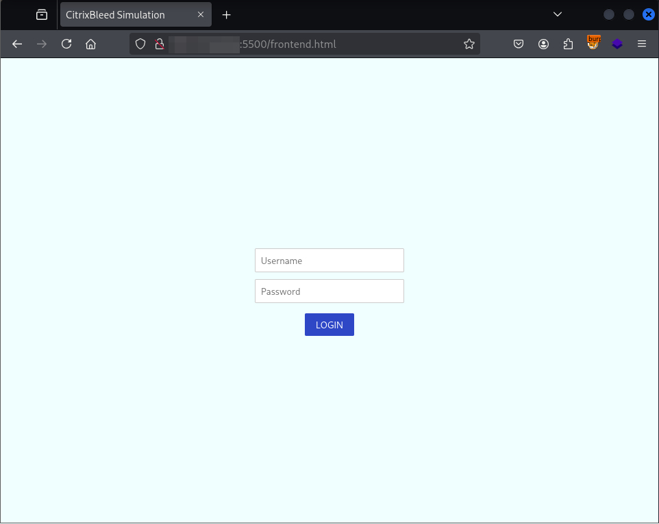
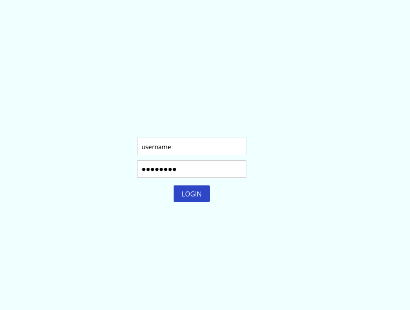
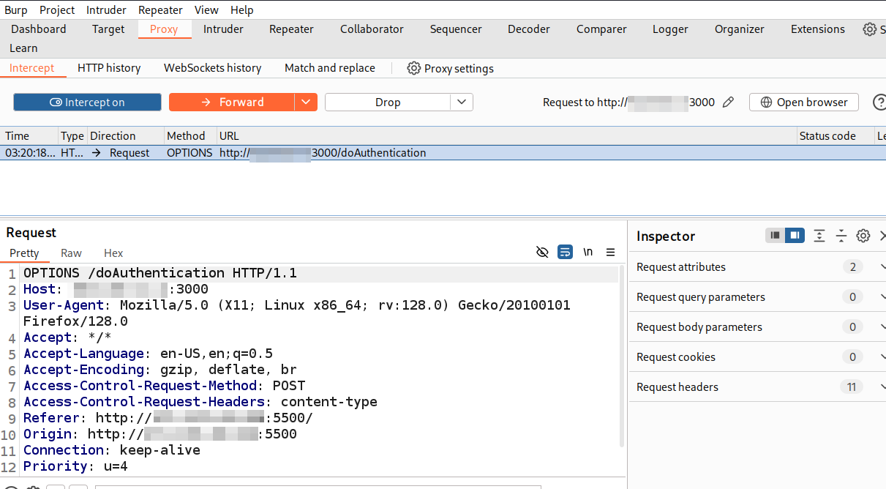
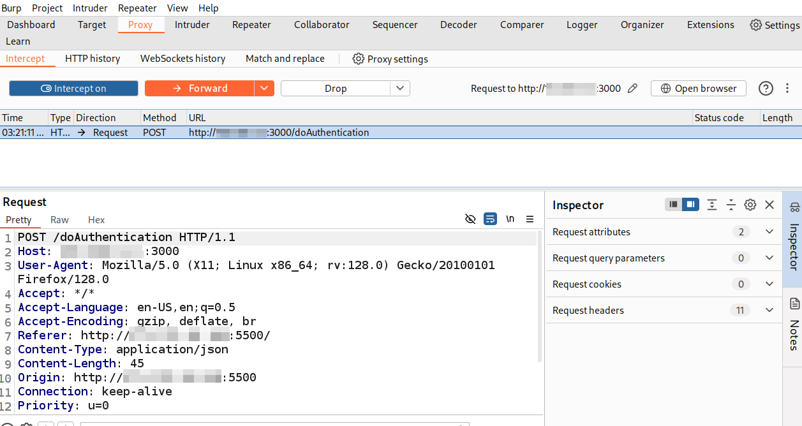
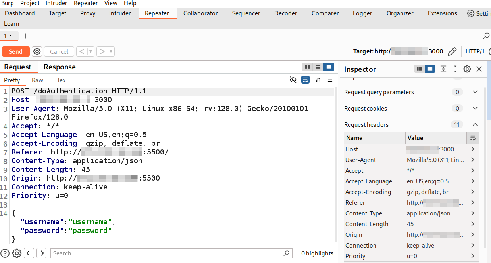
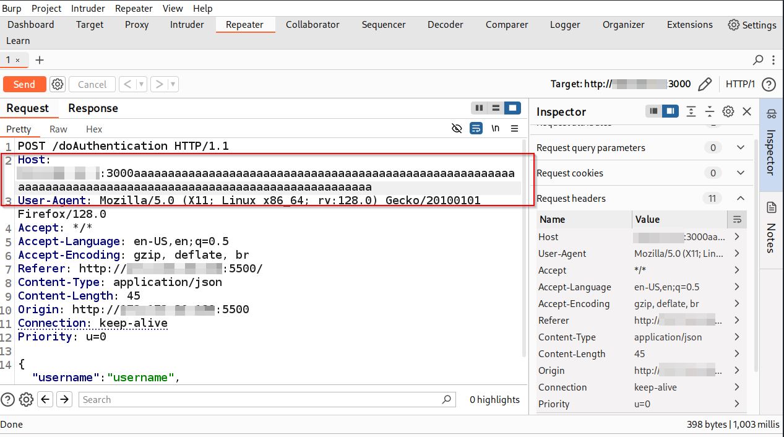
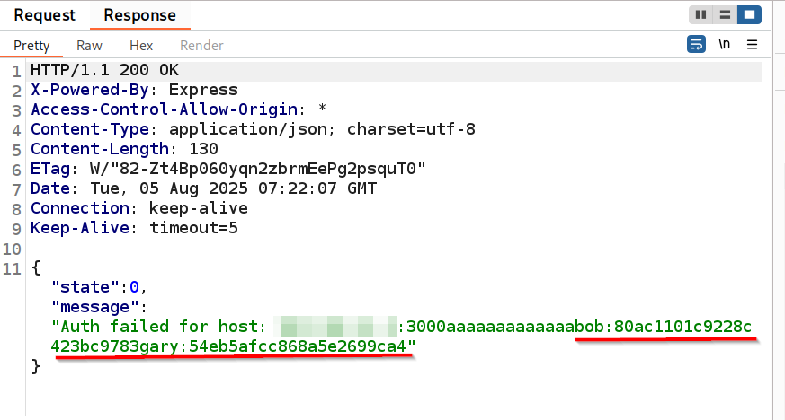
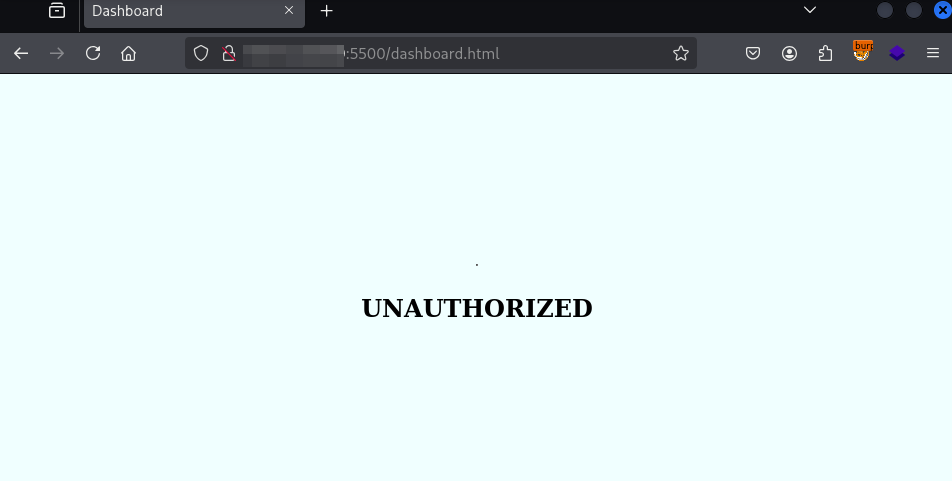
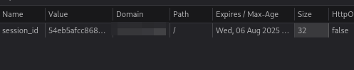
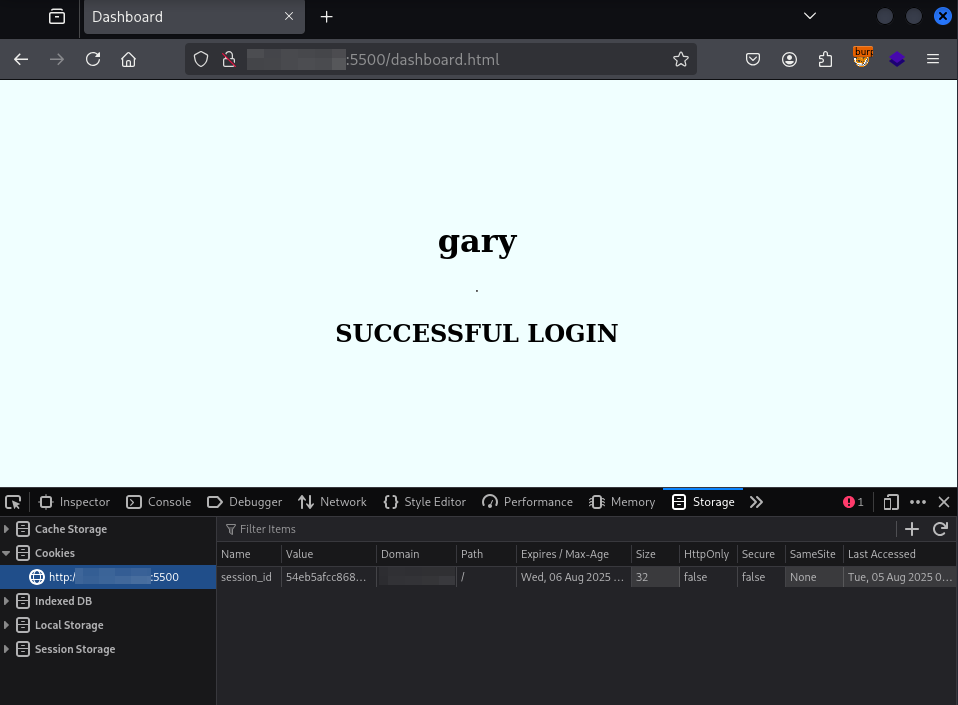

### **CitrixBleed Vulnerability \[ CVE-2023-4966 \]**

**Vulnerability Assessment**

The CitrixBleed vulnerability was a critical security flaw that affected Citrix NetScaler ADC and Gateway. It had a CVSS score of 9.4.  

It is a buffer overread vulnerability that allows an unauthenticated attacker to exploit the vulnerability in the /nf/auth/startwebview.do in the Citrix Netscaler ADC/ Gateway to fetch sensitive information such as user credentials,  session tokens, etc. allowing unauthorised access to the application.

According to the Citrix, the following products were affected:

* NetScaler ADC and NetScaler Gateway 14.1 before 14.1-8.50  
* NetScaler ADC and NetScaler Gateway 13.1 before 13.1-49.15  
* NetScaler ADC and NetScaler Gateway 13.0 before 13.0-92.19  
* NetScaler ADC 13.1-FIPS before 13.1-37.164  
* NetScaler ADC 12.1-FIPS before 12.1-55.300  
* NetScaler ADC 12.1-NDcPP before 12.1-55.300

What made CitrixBleed especially dangerous was the ease of exploitation, and the broad exposure due to widespread Citrix deployments. The ability to bypass authentication on these applications using the leaked data puts a large amount of issues at risk.

**Root Cause**

Attackers sent requests to the /nf/auth/startwebview.do endpoint to exploit a buffer overread issue that Citrix NetScaler systems had.

What is Buffer Overread?

A buffer overread, also known as out-of-bounds read, occurs when a program reads more data from memory than it should. This results in leakage of unintended and potentially sensitive information.

In the CitrixBleed case, the server reads user-supplied input into a fixed-size buffer. However, the input's original length (not the truncated one) was mistakenly used to determine how much data to send back to the user. As a result, by sending oversized data in headers, attackers could trick the system into leaking memory contents beyond the intended buffer, including session tokens used to bypass authentication.

Bishop Fox is a global offensive security firm known for their in-depth research and technical write-ups on vulnerabilities. They released a detailed analysis of the CitrixBleed vulnerability, identifying the vulnerable endpoint as /nf/auth/startwebview.do. Their research revealed that the root cause was a buffer overread stemming from the incorrect use of the snprintf() function in Citrix’s code.

snprintf() is a function that is used to safely write data into a buffer, truncating the input if it exceeds a certain size to prevent buffer overflow.   
However, the function returns the original size of the input it would have written even if it was truncated.  
Therefore, if the buffer size is 10 and the input size is 20\. The function truncates the input so that 10 is written into the buffer. However it will return size 20\.

Citrix NetScaler’s incorrectly processed the headers at the vulnerable endpoint. Internally, the server wrote the header value into a fixed-size stack buffer using snprintf().

Citrix’s code mistakenly used this return value to decide how many bytes to read back from the buffer into the HTTP response.   
As a result, when an attacker sent an oversized header, the server returned not only the header content but also adjacent stack memory up to about 127 bytes, which could contain sensitive data such as:

* Session cookies  
* nsroot administrator tokens  
* Plaintext user credentials  
* Other in-memory artifacts  
  

**REPLICATION**

To replicate this vulnerability I developed a simple html-based login page to show how the attackers would exploit the vulnerability to gain access to valid user accounts.    
This is the first page that is available to an attacker. 

Burp Suite is opened and then a request is sent for logging in with some random credentials.  

That request is intercepted using burp. The attacker first intercepts the CORS preflight request, the attacker can see the backend URL through this. So they know which request they can use to target the endpoint. 

This is the POST request to send the credentials to the backend server.  

The attacker then sends the POST request to the repeater to probe the backend to return some sensitive data.  
 
To do this, the attacker adds a large number of characters to the Host header (which is what is vulnerable) and then sends the request.

The program reads the header and then returns extra information from the buffer. This includes session id information and the username.

On a successful login, the users are directed to a dashboard. If we try to access this dashboard without a successful login, it shows UNAUTHORIZED.  

 However, the attacker can access it as a valid user using the session id that they would get in the prior steps. They add this value to the cookie/localstorage list..  

Now on reloading the site, the attacker is logged in as the user Gary.  

This is a very close replication of how an attack would have played out in most of the attacks.

**MITIGATION**

The immediate fix given by Citrix themselves was to kill all existing sessions so as to invalidate any existing sessions and then also update to the most recent version to implement the security patches.   
Commands to terminate sessions \-

* kill icaconnection \-all  
* kill rdp connection \-all  
* kill pcoipConnection \-all  
* kill aaa session \-all  
* clear lb persistentSessions

The correct fix was to avoid using the return value of snprintf() (or similar functions) to determine how much data to read from a buffer. Instead, programs must ensure they only access memory that was actually written, using bounds-checked lengths.

**REFERENCES**  
[https://unit42.paloaltonetworks.com/threat-brief-cve-2023-4966-netscaler-citrix-bleed/](https://unit42.paloaltonetworks.com/threat-brief-cve-2023-4966-netscaler-citrix-bleed/)  
[https://bishopfox.com/blog/netscaler-adc-and-gateway-advisory](https://bishopfox.com/blog/netscaler-adc-and-gateway-advisory)  
[https://www.sonicwall.com/blog/citrix-bleed-leaking-session-tokens-vulnerability](https://www.sonicwall.com/blog/citrix-bleed-leaking-session-tokens-vulnerability)  
Deep Dive into understanding the CitrixBleed vulnerability by Simones Cybersecurity ([https://www.youtube.com/watch?v=kR31QQ-N7nI\&t=1978s](https://www.youtube.com/watch?v=kR31QQ-N7nI&t=1978s))  
[https://cwe.mitre.org/data/definitions/126.html](https://cwe.mitre.org/data/definitions/126.html)  